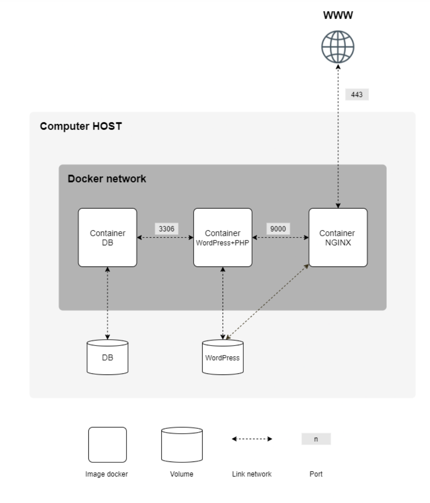

# 42-inception [](https://github.com/JaeSeoKim/badge42)


<div align="center">
<h1 align="center">

<br>
42-inception <a href="https://github.com/JaeSeoKim/badge42"><a href="https://github.com/JaeSeoKim/badge42"></a>

</h1>
<h3 align="center">📍Dockerized Service Infrastructure Setup/h3>
<h3 align="center">⚙️ Developed with the software and tools below:</h3>

<p align="center">


</p>
</div>
---
## 📍 Overview
   
   In this project, I utilized Docker to create a service infrastructure consisting of NGINX, MariaDB, and WordPress. Additionally, I integrated Grafana, Prometheus, and Node Exporter for monitoring the performance of the infrastructure. I employed Docker Compose and followed containerization best practices to successfully complete this project.
   
---
## 💫 Features
   
- nginx: Reverse proxy server that acts as the entry point for the infrastructure, handling requests on port 443 and forwarding them to the appropriate services.

- mariadb: Container for MariaDB, a relational database management system used for storing data in the WordPress application.

- php: Container for WordPress, a popular content management system for building websites, serving the web pages and connecting to the MariaDB container for data storage.

- redis: Container for Redis, an in-memory data structure store, used for caching and improving performance in the application.

- adminer: Container for Adminer, a web-based database management tool, used for convenient database administration and interaction.

- vsftpd: Container for vsftpd, a lightweight FTP server, used for accessing and managing files in the WordPress volume.

- prometheus: Container for Prometheus, a monitoring and alerting toolkit, used for collecting and storing metrics data from various services.

- nodeexporter: Container for Node Exporter, a Prometheus exporter for hardware and OS metrics, used for collecting system-level metrics from the host.

- grafana: Container for Grafana, a data visualization and monitoring tool, used for creating dashboards and visualizing metrics collected by Prometheus.

- snake: Container for a Snake game, providing a fun addition to the infrastructure.
---

## 🚀 Getting Started

### ✅ Prerequisites

Before you begin, ensure that you have the following prerequisites installed:
   
   - docker

### 🖥 Installation

1. Clone the 42-inception repository:
```sh
git clone https://github.com/jremy42/42-inception
```

2. Change to the project directory:
```sh
cd 42-inception
```

3. launch application:
```sh
make
```

4. for normal usage : 
http://localhost:80
  
---
### 🤖 Stack docker

<p align="center">
  
</p>

## 👏 Acquired knowledge
  
- ✅ Setting up a mini-infrastructure using Docker and Docker Compose.
  
- ✅ Building custom Docker images using Dockerfiles.
  
- ✅ Creating and managing containers for various services, including NGINX, MariaDB, WordPress, Redis, Adminer, vsftpd, Prometheus, Node Exporter, Grafana, and a Snake game.
  
- ✅ Configuring volumes to store data for WordPress and databases.
  
- ✅ Creating a Docker network to connect the containers.
  
- ✅  Implementing TLS encryption with NGINX using TLSv1.2 or TLSv1.3 protocols.
  
- ✅ Following best practices for Dockerfile writing and handling containers' entrypoints.
  
- ✅ Utilizing environment variables and storing them in a .env file.
  
- ✅ Understanding the principles of container restart and crash recovery.
  
- ✅ Avoiding the use of "hacky patch" techniques and using proper daemon processes.
  
- ✅ Applying good practices for PID 1 and managing container processes.
  
- ✅ Setting up additional services as bonuses, such as FTP server (vsftpd) and Adminer.


